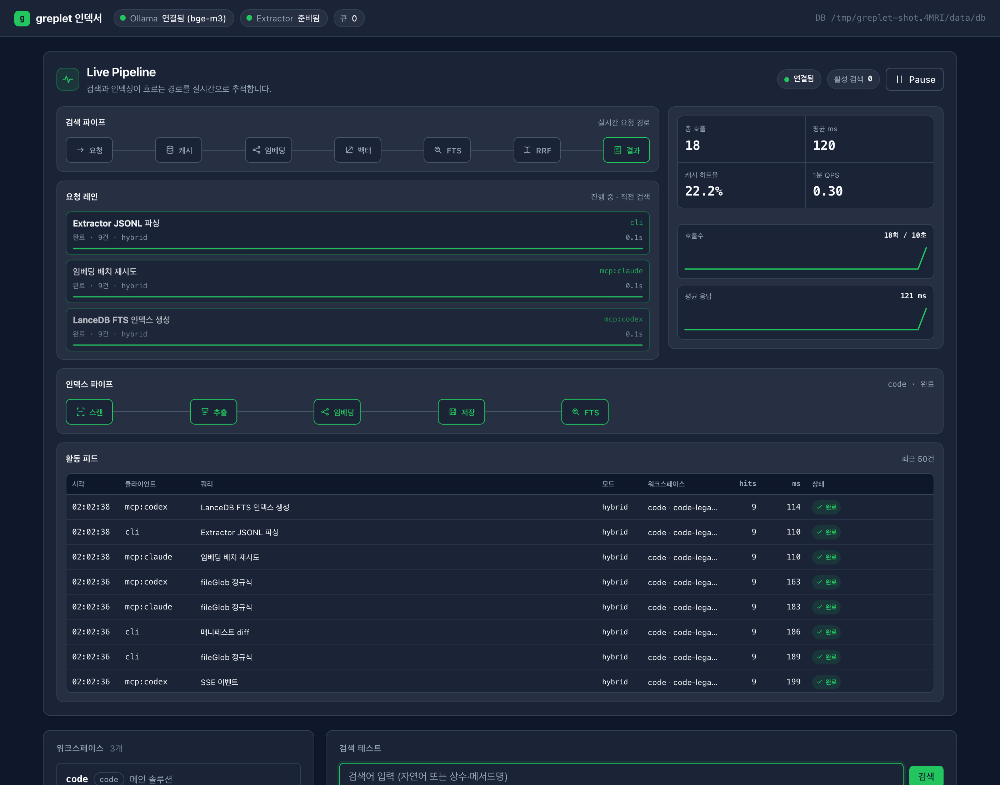

# greplet

<p align="center">
  <a href="README.md"></a>
  <a href="README.ko.md"></a>
  
  <a href="https://github.com/HoonStyle/greplet/actions/workflows/ci.yml"></a>
  
  
  
  
  <br>
  
  
  
  
  
  <br>
  
  
  
</p>

> 레거시 코드 여러 벌, 현재 코드, 사양서 PDF 를 한 번에 뒤져 **파일 · 심볼 · 줄 범위**로 답하는 로컬 검색 서버. AI 코딩 에이전트가 grep 대신 쓰도록 만들었다.

greplet 는 여러 리포지토리·폴더·PDF 를 **워크스페이스**로 묶어 인덱싱하고, 자연어나 키워드로 질의하면 관련 **청크**(C# 멤버, PDF 페이지 등)만 점수순으로 돌려주는 로컬 서비스다. 벡터 검색(Ollama `bge-m3`)과 전문 검색(BM25)을 RRF 로 융합한다. LLM 생성도, 외부 네트워크 호출도 없다.

일반 RAG 와 다른 점은 세 가지다.

1. **인덱스가 코드를 따라간다.** 파일 해시 매니페스트로 추가·변경·삭제를 증분 반영한다. 커밋 훅이 돌리므로 지운 파일의 청크가 검색에 남지 않는다.
2. **위치로 답한다.** C# 은 Roslyn 으로 타입·멤버 단위, PDF 는 페이지 단위로 자른다. 결과는 `파일 :: 심볼 (L시작-끝)` 형태라 에이전트는 그 자리만 열어 보면 된다.
3. **찾기만 한다.** 요약·해석·검증은 하지 않는다. 구조는 LSP(Serena), 사양 문서화와 인용 검증은 legacy-spec-agent 가 맡는 [역할 분담](#에이전트에서의-역할-분담)을 전제로 설계했다. 검색이 틀려도 다음 단계에서 걸러진다.

Claude Code 스킬, Codex, Claude Desktop MCP 번들, 원격 MCP 서버, CLI(PowerShell·Node), git 훅으로 붙여 쓴다. 목적은 하나다. 에이전트가 "이 기능 어디 구현돼 있어?", "사양서에 이 값 어떻게 정의돼 있어?" 같은 질문에 폴더 전체를 읽지 않고 답하게 하는 것.

<p align="center"><br><sub>관리 UI: 검색·인덱싱 Live Pipeline, 클라이언트 활동 피드, 워크스페이스 상태와 검색 테스트</sub></p>

## 목차

- [왜 필요한가](#왜-필요한가)
- [주요 기능](#주요-기능)
- [구조](#구조)
- [요구 환경](#요구-환경)
- [설치와 실행](#설치와-실행)
- [사용법](#사용법)
- [설정](#설정)
- [클라이언트](#클라이언트)
- [HTTP API](#http-api)
- [에이전트에서의 역할 분담](#에이전트에서의-역할-분담)
- [청킹 규칙](#청킹-규칙)
- [개발과 검증](#개발과-검증)
- [알려진 제약](#알려진-제약)
- [라이선스](#라이선스)

## 왜 필요한가

| 상황 | 기존 도구의 한계 | greplet |
|---|---|---|
| 레거시가 여러 벌이고, 현재 코드와 사양서 PDF 가 따로 있다 | IDE·에이전트 내장 검색은 열려 있는 리포 하나만 본다. Serena 도 활성 프로젝트 하나만 본다 | 리포 밖 어디든 여러 루트를 워크스페이스로 묶는다. `-All` 로 벌 간 비교까지 한 번에 |
| 상수·에러 코드·메서드명으로 찾는다 | 순수 벡터 검색은 정확 토큰에 약하다 | 벡터 + BM25 하이브리드. `fts` 모드는 Ollama 없이 동작 |
| 결과를 받아 바로 그 자리를 열어야 한다 | 고정 길이 청킹은 메서드 중간에서 끊기고 위치를 못 준다 | Roslyn 멤버 단위, PDF 페이지 단위. 모든 결과에 파일·심볼·줄 범위 |
| 코드가 계속 바뀐다 | 업로드형 RAG 는 삭제가 반영되지 않아 stale 청크가 쌓인다 | 파일 해시 매니페스트로 추가·변경·삭제 증분 반영. 커밋 훅 연동 |
| 소스를 외부로 보낼 수 없다 | 클라우드 검색은 업로드가 전제 | 완전 로컬. 인덱서는 `127.0.0.1` 에만 바인딩. 외부 노출은 Bearer 인증 MCP 서버 경유만 |

반대로 리포 하나에 문서 몇 개인 환경이면 greplet 을 쓸 이유가 약하다. 내장 검색이나 grep 으로 충분하다.

## 주요 기능

- **하이브리드 검색** — `hybrid`(기본) · `vector` · `fts` 세 모드.
- **Ollama 없이도 동작** — Ollama 가 없으면 영벡터로 인덱싱하고 검색은 `fts` 로 자동 강등한다. Ollama 가 생기면 다음 인덱스 잡이 전체 재인덱스로 승격돼 벡터를 채운다.
- **구문 단위 청킹** — C# 멤버 단위, PDF 페이지 단위, 그 외 텍스트는 줄 윈도우. 암호 PDF 지원.
- **증분 인덱싱** — 커밋 훅이나 API 호출로 변경분만 재인덱스.
- **다중 워크스페이스** — 코드·레거시·문서를 분리해 두고 개별 또는 통합 검색.
- **관리 UI** — 워크스페이스 상태, 파일 업로드, 재인덱스, 검색 테스트(파일 글롭 필터, 결과 클릭 시 VS Code/Cursor 로 열기), 실시간 로그, Live Pipeline 시각화와 클라이언트별 활동 피드.
- **결과 캐시** — 같은 질의는 인덱스가 바뀔 때까지 10분간 서버가 캐시. 반복 질의하는 에이전트의 임베딩 호출을 줄인다.
- **에이전트 연동** — Claude Code 스킬, Codex, MCP(stdio·원격), CLI, git 훅.

## 구조

```
[Claude Code skill / Codex / MCP / greplet.ps1 / greplet.mjs / post-commit]
                 │  HTTP (127.0.0.1:7802)
                 ▼
        indexer (Node/TS, Express)
      ┌──────────┼──────────────┐
  Extractor    Ollama         LanceDB
  (C#/Roslyn   bge-m3        벡터 + FTS
   PdfPig)     임베딩         RRF 하이브리드
```

| 폴더 | 역할 |
|---|---|
| `Extractor/` | C# 콘솔. Roslyn·PdfPig 로 파일을 청크 JSONL 로 변환 |
| `indexer/` | Node/TS 서비스. 스캔·임베딩·LanceDB 저장·검색 API·관리 UI |
| `greplet.ps1` | PowerShell CLI 클라이언트 (Windows) |
| `greplet.mjs` | Node CLI 클라이언트 (모든 OS) |
| `greplet-mcpb/` | Claude Desktop/Cowork 용 로컬 stdio MCP 번들. Codex 도 이 서버를 쓴다 |
| `mcp-server/` | Bearer 인증 원격 MCP 서버 |
| `git-hooks/` | 커밋 후 증분 인덱스를 트리거하는 post-commit 훅 |
| `examples/claude-code-skill/` | Claude Code 스킬 예제, CLAUDE.md 규칙 스니펫, SessionStart 훅 예제 |
| `examples/codex/` | Codex MCP 등록·스킬 예제 |
| `docs/design.md` | 상세 설계 문서 |

## 요구 환경

| 항목 | 값 |
|---|---|
| Node | 22+ |
| .NET SDK | 8.0+ |
| Ollama | 선택. `bge-m3` 모델 (`ollama pull bge-m3`). 없으면 `fts` 전용으로 동작 |
| PowerShell | 7+. Windows 에서 `greplet.ps1`·`start-indexer.ps1` 을 쓸 때만. 다른 OS 는 `greplet.mjs`·`start-indexer.sh` |
| OS | Windows · macOS · Linux. Intel Mac 은 LanceDB 버전 제약이 있다([알려진 제약](#알려진-제약)) |

## 설치와 실행

순서는 모든 OS 가 같다. Extractor 빌드 → 인덱서 빌드 → 워크스페이스 정의 → 기동.

.NET SDK 없이 쓰려면 [Releases](https://github.com/HoonStyle/greplet/releases) 에서 OS 별 self-contained Extractor(`greplet-extractor-<버전>-<rid>`)를 받아 압축을 풀고 `GREPLET_EXTRACTOR` 로 그 경로를 지정한다. 그러면 아래의 `dotnet build` 단계를 건너뛴다. Claude Desktop 용 `.mcpb` 도 같은 곳에 있다. 버전별 변경 내역은 [CHANGELOG.md](CHANGELOG.md).

**Windows (PowerShell)**

```powershell
dotnet build Extractor -c Release

cd indexer
npm install
npm run build
cp workspaces.example.json workspaces.json     # roots 를 실제 경로로 수정
pwsh start-indexer.ps1                         # 백그라운드 기동, healthz 확인
```

**macOS / Linux (bash)**

```bash
# macOS 에 .NET 8 이 없다면. dotnet@8 은 keg-only 라 PATH 에 안 들어간다
brew install dotnet@8
export DOTNET_ROOT=/usr/local/opt/dotnet@8/libexec     # Apple Silicon: /opt/homebrew/opt/dotnet@8/libexec
export PATH="$DOTNET_ROOT:$PATH"                        # start-indexer.sh 는 이 keg 를 자동 감지한다

dotnet build Extractor -c Release

cd indexer
npm install
npm i @lancedb/lancedb@0.22.3                  # Intel Mac 만. Apple Silicon·Linux 는 불필요
npm run build
cp workspaces.example.json workspaces.json     # roots 를 실제 경로로 수정
bash start-indexer.sh                          # 백그라운드 기동, healthz 확인
```

기동 후 `http://localhost:7802` 관리 UI 에서 **[전체 재인덱스]** 를 누르면 첫 인덱싱이 시작된다. 기동 스크립트에 `--open`(bash) 또는 `-OpenUI`(PowerShell)를 주면 기동 확인 직후 관리 UI 를 기본 브라우저로 연다. 환경변수 `GREPLET_OPEN_UI=1` 도 같은 효과다.

Claude Code 세션이 열릴 때마다 인덱서를 띄우고 UI 를 열려면 SessionStart 훅에 그 명령을 등록한다. 예시는 [`examples/claude-code-skill/hooks.settings.json`](examples/claude-code-skill/hooks.settings.json).

데이터(LanceDB·매니페스트·업로드·로그)는 `GREPLET_DATA_DIR` 에 저장되며 기본값은 OS 별로 다르다.

| OS | 기본 경로 |
|---|---|
| Windows | `%LOCALAPPDATA%\greplet` |
| macOS | `~/Library/Application Support/greplet` |
| Linux | `$XDG_DATA_HOME/greplet` (기본 `~/.local/share/greplet`) |

로그온 시 자동 기동은 Windows 는 작업 스케줄러에 `pwsh -File <경로>\indexer\start-indexer.ps1`, macOS 는 launchd, Linux 는 systemd user service 로 `node indexer/dist/server.js` 를 등록한다.

## 사용법

**Windows (PowerShell)**

```powershell
pwsh greplet.ps1 -Query "재시도 백오프 로직"                    # 기본 워크스페이스 의미 검색
pwsh greplet.ps1 -Query "0x0A03" -Mode fts                      # 정확 토큰 (상수·에러 코드·메서드명)
pwsh greplet.ps1 -Query "설정 파일 스키마" -Workspace docs -TopN 8
pwsh greplet.ps1 -Query "에러 코드" -All -Full                  # 모든 워크스페이스 통합, 청크 전문
```

**모든 OS (Node)**

```bash
node greplet.mjs "재시도 백오프 로직"
node greplet.mjs "0x0A03" --mode fts
node greplet.mjs "설정 파일 스키마" -w docs --top-n 8
node greplet.mjs "에러 코드" --all --full
node greplet.mjs "재시도" --file "Lib/**/*.cs"      # 파일 경로 글롭으로 결과 필터
node greplet.mjs "재시도" --all --json | jq '.hits[0]'   # 서버 JSON 그대로

node greplet.mjs status                             # 서버·Ollama·Extractor·큐 상태
node greplet.mjs workspaces                         # 워크스페이스 목록과 인덱스 통계
node greplet.mjs index code --wait                  # 증분 인덱스 후 완료까지 로그 출력
node greplet.mjs index docs --force                 # 전체 재인덱스 잡 등록
```

`greplet.mjs` 의 관리 서브커맨드(`status` · `workspaces` · `index`)는 curl 없이 인덱서를 다루기 위한 것이다. 검색 결과는 인덱스가 바뀌지 않는 한 서버가 10분간 캐시하며, 캐시된 응답은 `cached: true` 로 표시된다.

출력 예:

```
[code] "재시도 백오프 로직" -> 총 6건 (점수순)
======================================================================
#1  score 0.0328  |  Lib/Retry/RetryPolicy.cs :: RetryPolicy.Execute (L120-161)
// Lib/Retry/RetryPolicy.cs // namespace My.Lib.Retry // class RetryPolicy : IRetryPolicy public bool Execute(...
----------------------------------------------------------------------
```

### 검색 모드

| mode | 동작 | 용도 |
|---|---|---|
| `hybrid` (기본) | 벡터 + FTS → RRF 융합 | 대부분의 내용 검색 |
| `vector` | 의미 검색만 | 표현이 다른 유사 코드 찾기 |
| `fts` | BM25 만, 임베딩 호출 없음 | 정확 토큰. Ollama 없이도 동작 |

임베딩 없이 인덱싱된 워크스페이스에 `hybrid`/`vector` 를 요청하면 서버가 `fts` 로 강등하고 응답의 `warnings` 에 알린다.

## 설정

### 워크스페이스 (`indexer/workspaces.json`)

워크스페이스 목록의 단일 소스다. 모든 클라이언트는 이 파일이나 서버의 `GET /api/workspaces` 에서 목록을 읽는다.

```json
[
  { "slug": "code", "label": "메인 솔루션", "kind": "code",
    "roots": ["C:\\work\\my-solution"] },
  { "slug": "docs", "label": "사양서·매뉴얼", "kind": "docs",
    "roots": ["/Users/me/work/specs"],
    "includeExt": [".pdf", ".html", ".md"],
    "pdfPasswordFile": "/Users/me/work/specs/passwords.txt" }
]
```

`roots` 에는 어느 OS 경로든 쓸 수 있다. Windows 경로는 JSON 문자열이므로 백슬래시를 `\\` 로 이스케이프한다.

| 필드 | 설명 |
|---|---|
| `slug` | 검색·API 에서 쓰는 식별자 |
| `label` | 관리 UI 표시 이름 |
| `kind` | `code` 또는 `docs`. 기본 확장자·제외 규칙이 달라진다 |
| `roots` | 인덱스할 루트 폴더 목록 |
| `includeExt` | 대상 확장자. `code` 기본 `.cs .csproj .sln .xaml .proto .config .settings .manifest .md`, `docs` 기본 `.pdf` |
| `excludeDirs` / `excludeFiles` | 명시하면 기본값을 대체한다 |
| `pdfPasswordFile` | 암호 PDF 용 비밀번호 목록 파일 |

자세한 규칙은 [docs/design.md §3](docs/design.md).

### 환경변수

| 변수 | 기본값 | 설명 |
|---|---|---|
| `GREPLET_PORT` | `7802` | 인덱서 포트 |
| `GREPLET_DATA_DIR` | OS 별 기본값(위 표) | DB·매니페스트·업로드·로그 저장 위치 |
| `GREPLET_WORKSPACES` | `indexer/workspaces.json` | 워크스페이스 정의 파일. CLI(`greplet.ps1`·`greplet.mjs`)도 기본 워크스페이스를 여기서 읽으므로 서버에 다른 경로를 줬다면 CLI 에도 같은 값을 넘긴다 |
| `GREPLET_EXTRACTOR` | `Extractor/bin/Release/net8.0/Extractor.exe` (Windows) / `…/Extractor` (macOS·Linux) | Extractor 실행 파일 |
| `GREPLET_DEFAULT_WORKSPACE` | 첫 워크스페이스 | 워크스페이스 미지정 시 기본값 (CLI·MCP) |
| `GREPLET_OPEN_UI` | 없음 | `1` 이면 기동 스크립트가 기동 확인 후 관리 UI 를 브라우저로 연다 (`--open`/`-OpenUI` 와 동일) |
| `GREPLET_CLIENT_NAME` | 클라이언트별 기본값 | `/api/search` 에 보내고 활동 피드에 표시할 클라이언트 이름. `^[a-z0-9:_-]{1,32}$` 형식만 허용 |
| `GREPLET_ACTIVITY_QUERY` | 없음 | `hidden` 이면 활동 이벤트·이력의 질의를 `(hidden)` 으로 바꾼다 |
| `OLLAMA_URL` | `http://localhost:11434` | Ollama 주소 |

## 클라이언트

| 클라이언트 | 위치 | 비고 |
|---|---|---|
| PowerShell CLI | `greplet.ps1` | `-Query -Workspace -All -TopN -Full -Mode -BaseUrl`. Windows |
| Node CLI | `greplet.mjs` | `<query> -w --all --top-n --full --mode --file --json` 과 `status` · `workspaces` · `index <slug> [--force] [--wait]`. 모든 OS |
| Claude Code 스킬 | `examples/claude-code-skill/SKILL.md` | `.claude/skills/greplet/` 에 복사하고 워크스페이스 목록만 채운다 |
| Claude Desktop / Cowork | `greplet-mcpb/` | `npm run pack` → `.mcpb` 설치. stdio, 인증 없음 |
| Codex | `examples/codex/` | `config.toml` 에 `greplet-mcpb/server/index.js` 를 stdio MCP 로 등록. 스킬 예제 포함 |
| 원격 MCP | `mcp-server/` | Streamable HTTP + Bearer, `127.0.0.1:7801`. 외부 노출은 터널 경유. [README](mcp-server/README.md) |
| git 훅 | `git-hooks/post-commit` | `git config greplet.slug <slug>` 후 `.git/hooks/` 에 복사 |

MCP 툴은 `greplet`(검색)과 `greplet_workspaces`(목록) 두 개이며 모두 `readOnlyHint` 가 붙어 있어 승인 없이 호출된다.

## HTTP API

인덱서는 `127.0.0.1:7802` 에 무인증으로 뜬다. 외부에 열려면 `mcp-server` 를 앞에 둔다.

| 메서드·경로 | 용도 |
|---|---|
| `GET /healthz` | 가동 확인 |
| `GET /api/status` | Ollama·Extractor·큐 상태 |
| `GET /api/workspaces` | 워크스페이스 목록과 인덱스 통계 |
| `POST /api/search` | `{ query, workspaces: string[] \| "all", topN, mode, fileGlob? }`. `fileGlob` 은 파일 상대경로 글롭(`*`·`**`·`?`). 응답 hit 에 `abs`(절대경로) 포함, 캐시 응답은 `cached: true` |
| `POST /api/index/:slug` | 증분 인덱스 잡 등록. `{ force: true }` 로 전체 재인덱스 |
| `GET /api/jobs` · `GET /api/jobs/:id/events` | 잡 목록, SSE 로그 스트림 |
| `POST /api/upload/:slug` | 파일 업로드 후 증분 인덱스 |
| `DELETE /api/workspaces/:slug/files?file=` | 업로드 파일 삭제 |

전체 요청·응답 형식은 [docs/design.md §5.5](docs/design.md).

## 에이전트에서의 역할 분담

greplet 는 "어디에 무슨 내용이 있나"를 찾는 도구다. 나머지는 다른 도구에 맡긴다.

| 질문 | 도구 | 이유 |
|---|---|---|
| 이 기능이 어디 구현돼 있나, 문서에 어떻게 정의돼 있나 | **greplet** | 폴더째 grep/read 보다 빠르고 토큰을 훨씬 덜 쓴다 |
| 이 메서드를 누가 호출하나, 상속·참조 체인 | **LSP 심볼 도구** ([Serena](https://github.com/oraios/serena) 등) | greplet 는 청크 텍스트만 알고 참조 관계는 모른다 |
| 문서 없는 레거시 코드의 사양을 인용 근거와 함께 문서화 | **[legacy-spec-agent](https://github.com/HoonStyle/legacy-spec-agent)** | greplet 는 해석·요약·검증을 하지 않는다 |
| 파일명·경로 찾기, 방금 편집한 파일 확인 | **Glob / Grep / Read** | 인덱스가 아직 안 따라왔을 수 있다 |
| 정확 문자열의 완전한 출현 목록 | **Grep** | 하이브리드는 topN 만 돌려준다. `fts` 로 후보를 좁힌 뒤 Grep 으로 확인 |

규칙 파일(CLAUDE.md 등)에 넣어 둘 원칙: 내용 검색은 greplet 먼저, 구조는 LSP, 경로는 Glob/Grep. greplet 결과가 비거나 서버가 꺼져 있을 때만 폴더 스캔으로 폴백. 예시는 [`examples/claude-code-skill/CLAUDE.md.snippet`](examples/claude-code-skill/CLAUDE.md.snippet).

### greplet + Serena + legacy-spec-agent

레거시 코드 여러 벌과 현재 프로젝트, 사양서 PDF 가 뒤섞인 환경에서 쓰는 조합이다. 세 도구는 서로를 호출하지 않는다. 에이전트가 각 결과를 받아 조합한다.

| 도구 | 준비 | 담당 |
|---|---|---|
| greplet | 레거시 각 벌·현재 프로젝트·문서를 워크스페이스로 분리 (`code`, `code-legacy`, `docs`) | 내용 검색. "이 값 어디서 정의되나", "사양서에서 이 프로토콜 설명" |
| Serena | 레거시 각 벌과 현재 프로젝트를 모두 Serena 프로젝트로 등록. 고정하지 않고 요청이 가리키는 쪽을 `activate_project` 로 그때그때 전환 | 구조 질의. 참조·호출 체인·상속, 심볼 단위 읽기와 편집 |
| legacy-spec-agent | Claude Code / Codex 플러그인 설치 | `path:line` 인용이 붙은 SPEC/ARCHITECTURE 역생성, 코드 변경 후 drift 검사 |

Serena 를 `--project` 로 프로젝트를 지정해 띄우면 `claude-code`·`ide` 컨텍스트에서 `activate_project` 툴이 꺼진다. 전환하며 쓰려면 프로젝트 없이 기동해야 한다 ([Serena 문서](https://oraios.github.io/serena/02-usage/040_workflow.html)).

"레거시 기능을 현재 프로젝트로 옮기기"의 전형적인 흐름:

1. **greplet** `-Workspace code-legacy` 로 기능·상수·에러코드가 있는 파일과 위치를 찾는다. 정확 토큰은 `-Mode fts`.
2. **Serena** 로 그 심볼의 참조·호출 체인을 따라가 실제 범위를 확정한다.
3. **legacy-spec-agent** 로 그 범위의 사양 문서를 뽑는다. 인용이 없는 주장은 Unverified 로 남는다.
4. **greplet** `-Workspace docs` 로 사양서 PDF 의 해당 정의를 대조한다.
5. **greplet** `-Workspace code` 와 **Serena** 로 현재 프로젝트의 대응 위치를 찾아 반영한다.
6. 커밋 훅이 greplet 증분 인덱스를 돌리므로 다음 검색부터 바뀐 코드가 반영된다.

역할이 겹칠 때의 선택 기준:

- 파일 위치를 모른다 → greplet. 심볼 이름을 안다 → Serena.
- 여러 레거시 벌에서 같은 기능이 어떻게 다른지 → greplet `-All`. Serena 는 활성 프로젝트 하나만 보므로 벌마다 전환해야 한다.
- 결과를 문서로 남겨야 한다 → legacy-spec-agent. greplet 출력은 근거 위치를 찾는 용도이지 산출물이 아니다.

## 청킹 규칙

- **C#**: 타입 선언·멤버(메서드/생성자/속성/이벤트/연산자)·필드 묶음을 각각 청크로. 모든 청크 앞에 `// file` `// namespace` `// class X : Base` 헤더 3줄. 6000자 초과 멤버는 4000/400 윈도우, 300자 미만 연속 멤버는 1200자까지 병합.
- **PDF**: 페이지 = 청크. 암호 PDF 지원. 스캔 이미지 페이지는 스킵.
- **HTML/Markdown/XAML/기타**: 3000/300 줄 윈도우. HTML 은 script·style 제거 후 평문화.
- **인코딩**: UTF-8 → CP949 폴백.

전체 사양은 [docs/design.md](docs/design.md).

## 개발과 검증

```bash
dotnet build Extractor -c Release
cd indexer && npm run build && npm run test:incremental
cd ../mcp-server && npm run build && MCP_AUTH_TOKEN=<token> npm run smoke
cd ../greplet-mcpb && npm install && npm run smoke
```

PowerShell 에서는 `MCP_AUTH_TOKEN=<token>` 대신 `$env:MCP_AUTH_TOKEN = "<token>"` 을 먼저 설정한다. 개발 중에는 `indexer/` 와 `mcp-server/` 에서 `npm run dev`(tsx) 로 빌드 없이 실행할 수 있다.

## 알려진 제약

- 청커는 C# 에 특화돼 있다. 다른 언어는 텍스트 윈도우로 들어간다(확장자를 `includeExt` 에 추가).
- 벡터 인덱스를 만들지 않는다(flat 스캔). 워크스페이스당 수십만 청크를 넘기면 검색이 느려진다.
- 인덱서 HTTP API 는 무인증이라 `127.0.0.1` 에만 바인딩한다.
- Intel Mac(darwin-x64)용 `@lancedb/lancedb` 네이티브 바이너리는 0.22.3 이 마지막이다(0.23.0 은 의존성 목록에만 있고 패키지가 배포되지 않았다). `npm install` 뒤 `npm i @lancedb/lancedb@0.22.3` 을 한 번 더 실행한다. Apple Silicon·Linux·Windows 는 해당 없음.
- Ollama 없이 인덱싱한 워크스페이스는 벡터가 비어 있어 `fts` 만 의미가 있다. Ollama 가 준비되면 다음 인덱스 잡이 전체 재인덱스로 자동 승격된다.

## 라이선스

[MIT](LICENSE)
